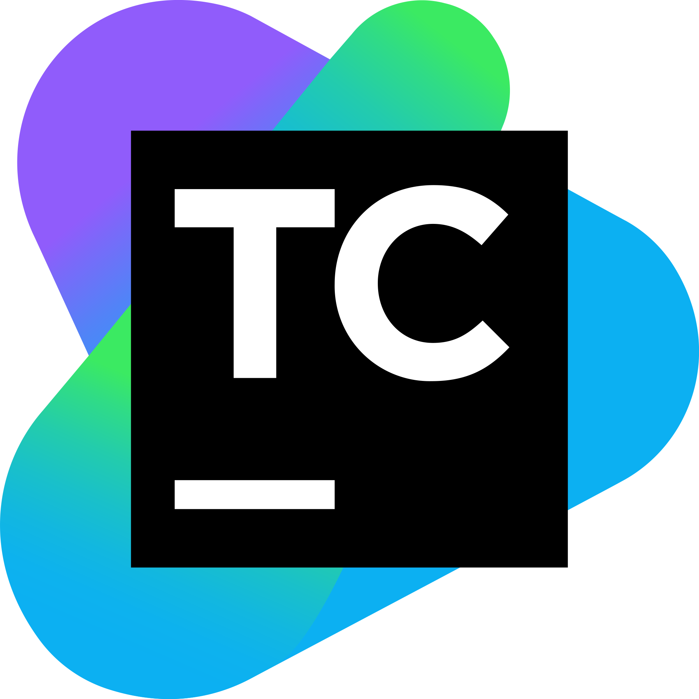

<h1 align="center">
 <a> Начало работы с шаблонным проектом по автоматизированному тестированию для платформы "СФЕРА"</a>  
</h1> 

# <a>Содержание</a>

+ [Технологии и инструменты](#Technology)
+ [Краткое описание технологий и инструментов](#TechnologyDescription)
+ [Настройка проекта](#ProjectSettings)
+ [Запуск в TeamCity](#TeamCity)
+ [Отдельные README.md для API, UI, DB тестирования](#Instructions)
+ [Авторы и контакты](#Сontacts)

<h1 align="left">
<a name="Technology">Технологии и инструменты</a>
</h1>

  
  
  
  

 
 

  

# <a name="TechnologyDescription">Краткое описание технологий и инструментов</a>

:question: *Что и для чего мы используем в нашем шаблонном проекте:*

- Библиотеку [Owner](http://owner.aeonbits.org/docs/features/) для лёгкой и гибкой конфигурации автотестов через Properties
- Библиотеку [JDBI](https://jdbi.org/) для работы с базой данных
- Framework [JUnit5](https://junit.org/junit5/docs/current/user-guide/) для написания и выполнения автотестов с использованием аннотаций
- Библиотеку [AssertJ](https://assertj.github.io/doc/#assertj-core-custom-assertions) для осуществления кастомных проверок в тестах
- Инструмент для сборки [Gradle](https://docs.gradle.org/current/userguide/what_is_gradle.html)
- Инструмент [Allure Report](https://docs.qameta.io/allure/) для визуализации результатов тестирования
- Инструмент CI/CD  [TeamCity](https://www.jetbrains.com/help/teamcity/teamcity-documentation.html) для удаленного запуска автотестов
- Инструмент [Bitbucket](https://bitbucket.org/product/guides) для хостинга кода и совместной работы, основанный на системе контроля версий Git
- Framework [Selenide](https://selenide.gitbooks.io/user-guide/content/ru/selenide-api/selenide.html) для удобного написания UI автотестов
- Шаблон проектирования автотестов [Page Object](https://www.selenium.dev/documentation/test_practices/encouraged/page_object_models)
- Библиотеку [Lombok](https://auth0.com/blog/a-complete-guide-to-lombok/) для сокращения шаблонного кода
- Библиотеку [Jackson](https://www.baeldung.com/jackson/)  для сериализации и десериализации объектов
- Библиотеку [Rest Assured](https://github.com/rest-assured/rest-assured/wiki/Usage) для тестирования REST API с
  использованием библиотек Java
- Библиотеку [Pebble Templates](https://pebbletemplates.io/)  для шаблонов с переменными, в которые в дальнейшем
  подставляются нужные данные

<h1 align="left">
<a name="ProjectSettings">Настройка проекта</a>
</h1>

>- В файлах `settings.gradle.kts` необходимо поменять переменную `$mavenUrl` на Url `https://nexus-ci.corp.dev.vtb/repository/yourProjectCode-maven`, 
где yourProjectCode- код Вашего проекта в Bitbucket например **PPIN**
>- `settings.gradle.kts` необходимо поменять переменную `${mavenUrl}-lib` на Url `https://nexus-ci.corp.dev.vtb/repository/yourProjectCode-maven-lib`, 
где yourProjectCode- код Вашего проекта в Bitbucket например **PPIN**
>- `settings.gradle.kts` необходимо поменять переменную `rootProject.name` на название Вашего репозитория в Bitbucket
>- В файлах `build.gradle.kts` необходимо поменять переменную `$mavenUrl` на Url `https://nexus-ci.corp.dev.vtb/repository/yourProjectCode-maven`,
где yourProjectCode- код Вашего проекта в Bitbucket например **PPIN**
>- `build.gradle.kts` необходимо поменять переменную `${mavenUrl}-lib` на Url `https://nexus-ci.corp.dev.vtb/repository/yourProjectCode-maven-lib`, 
где yourProjectCode- код Вашего проекта в Bitbucket например **PPIN**
>- `build.gradle.kts` необходимо поменять переменную group `ru.vtb.at.projectname` на название Вашего репозитория в Bitbucket

<h1 align="left">
  <a name="TeamCity">Запуск автотестов в TeamCity </a>
</h1>

>- В папке`teamcity` в файле `pom.xml` необходимо переименовать **PROJECTCODE** на код своего проекта например **PPIN**
>- В папке`teamcity` в файле `settings.kts` необходимо переименовать **PROJECTCODE_TESTS_Autotests** на ID вашего VCS с тестами

# <a name="Instructions">Отдельные README.md для API, UI, DB тестирования</a>

:bangbang: Подробное описание данного проекта по видам тестирования Вы найдёте в следующих Readme файлах:
> - `README_API.md` описание работы с API
>- `README_UI.md` описание работы с UI
>- `README_Common.md` описание работы с DB

# <a name="Contacts">Авторы и контакты</a>

[Наверх ⬆](#наверх)
